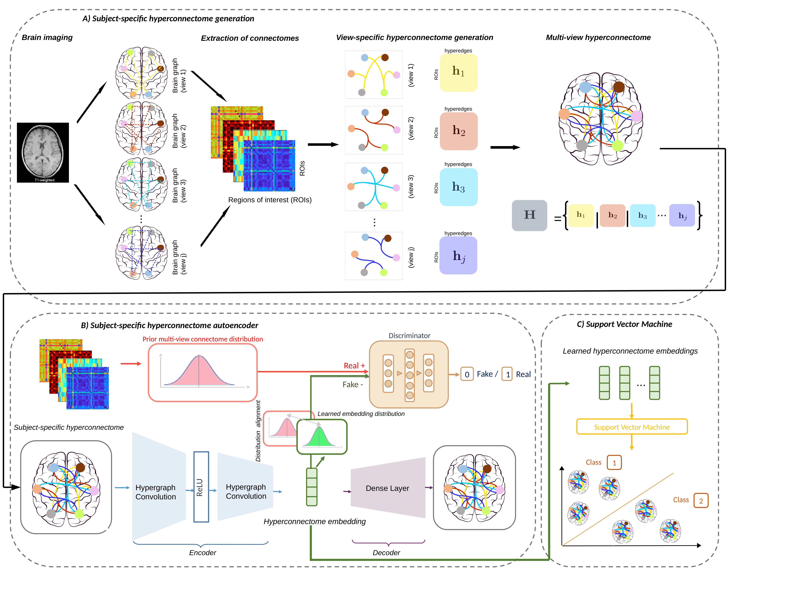

# HCAE in Python (HyperConnectome AutoEncoder)
HCAE (HyperConnectome AutoEncoder) for brain state identification, coded up by Alin Banka and Inis Buzi. Please contact alin.banka@gmail.com for further inquiries. Thanks. 



> **Multi-View Brain HyperConnectome AutoEncoder For Brain State Classification** <br/>
> [Alin Banka](https://scholar.google.com/citations?user=2J9FdJkAAAAJ&hl=en)<sup>1,2</sup>, [Inis Buzi](https://www.researchgate.net/profile/Inis_Buzi)<sup>1, 2</sup>, [Islem Rekik](https://scholar.google.co.uk/citations?user=tb6CVoAAAAAJ&hl=en)<sup>1,2</sup><br/>
> <sup>1</sup> BASIRA Lab, Faculty of Computer and Informatics, Istanbul Technical University, Istanbul, Turkey
> <sup>2</sup> Istanbul Technical University, Istanbul, Turkey
>
> **Abstract:** *Graph embedding is a powerful method to represent graph neurological data (e.g., brain connectomes) in a low dimensional space for brain connectivity mapping, prediction and classification. However, existing embedding algorithms have two major limitations. First, they primarily focus on preserving one-to-one topological relationships between nodes (i.e., regions of interest (ROIs) in a connectome), but they have mostly ignored many-to-many relationships (i.e., set to set), which can be captured using a hyper-connectome structure. Second, existing graph embedding techniques cannot be easily adapted to multi-view graph data with heterogeneous distributions. In this paper, while cross-pollinating adversarial deep learning with hypergraph theory, we aim to jointly learn deep latent embeddings of a population of multi-view brain graphs to eventually disentangle different brain dementia states such as Alzheimer’s disease (AD) versus mild cognitive impairment (MCI). First, we propose a new simple strategy to build a weighted hyper-connectome based on nearest neighbour algorithm to preserve the connectivities across pairs of ROIs. Second, for each brain view, we create a hyper-connectome. Next, we design a hyper-connectome autoencoder (HCAE) framework which operates directly on the multi-view hyper-connectomes based on hypergraph convolutional layers to better capture the many-to-many relationships between brain regions (i.e., graph nodes). For each subject, we further regularize the hypergraph autoencoding by adversarial regularization to align the distribution of the learned hyper-connectome embeddings with the original hyper-connectome distribution.  Our results show that HCAE achieves promising results in AD/MCI classification compared with deep graph-based autoencoding methods. Our HCAE code is available at http://github.com/basiralab/HCAE.*


This paper is submitted to PRIME MICCAI 2020. While cross-pollinating adversarial deep learning with hypergraph theory, we aim to jointly learn deep latent embeddings of a population of multi-view brain graphs to eventually disentangle different brain states such as Alzheimer’s disease (AD) versus mild cognitive impairment (MCI). First, we propose a new simple strategy to build a weighted hyperconnectome for each brain view based on the nearest neighbor algorithm to preserve the connectivities across pairs of ROIs. Second, we design a hyperconnectome autoencoder (HCAE) framework which operates directly on the multi-view hyperconnectomes based on hypergraph convolutional layers to better capture the many-to-many relationships between brain regions (i.e.,graph nodes). For each subject, we further regularize the hypergraph autoencoding by adversarial regularization to align the distribution of the learned hyperconnectome embeddings with the original hyperconnectome distribution. We evaluate HCAE on ADNI GO public dataset. Our results show that embeddings learned by HCAE yield to better results for AD/MCI classification compared with deep graph-based autoencoding methods.

## Dependencies

The code has been tested with Python 3.7, Anaconda2-5.3.0 and TensorFlow 1.5 on Ubuntu 19.04. GPU is not needed to run the code. You also need some of the following Python packages, which can be installed via pip:

* [Tensorflow 1.5.0](https://www.tensorflow.org/)
* [Scikit-learn 0.23.0+](https://scikit-learn.org/stable/)
* [Numpy 1.18.1+](https://numpy.org/)
* [Scipy](https://www.scipy.org/)

# Demo

We provide a demo code for the usage of HCAE. In demo.py we run HCAE on a simulated dataset.

To run our demo:
```bash
python3 demo.py
```

# Data format
In order to use our framework, you need to provide:
* Data samples of size (m * m) which will be used to produce node features and incidence matrix. The multi-view option can be selected if there are multiple such matrices for a sample.
* A label list denoting the label of each subject in the dataset such as healthy or disordered.


# Related references

Adversarially Regularized Graph Autoencoder (ARGA): Pan, S., Hu, R., Long, G., Jiang, J., Yao, L., Zhang, C.: Adversarially regularized graph autoencoder. [https://arxiv.org/abs/1802.04407] (2018) [https://github.com/Ruiqi-Hu/ARGA].

Hypergraph Neural Networks (HGNN): Feng, Y., You, H., Zhang, Z., Ji, R., Gao, Y.: Hypergraph Neural Networks. arXiv e-prints (2018) arXiv:1809.09401 [https://github.com/iMoonLab/HGNN].


# Please cite the following paper when using HCAE:

```latex
@inproceedings{bankaetal2020,
title={Multi-View Brain HyperConnectome AutoEncoder For Brain State Classification},
author={Banka, Alin and Buzi, Inis and Rekik, Islem},
booktitle={International Workshop on PRedictive Intelligence In MEdicine},
year={2020},
organization={Springer}
}
```

# HCAE on arXiv

https://arxiv.org/abs/2009.11553

# Acknowledgement

I. Rekik is supported by the European Union’s Horizon 2020 research and innovation programme under the Marie Sklodowska-Curie Individual Fellowship grant agreement No 101003403 (http://basira-lab.com/normnets/).


# License
Our code is released under MIT License (see LICENSE file for details).
